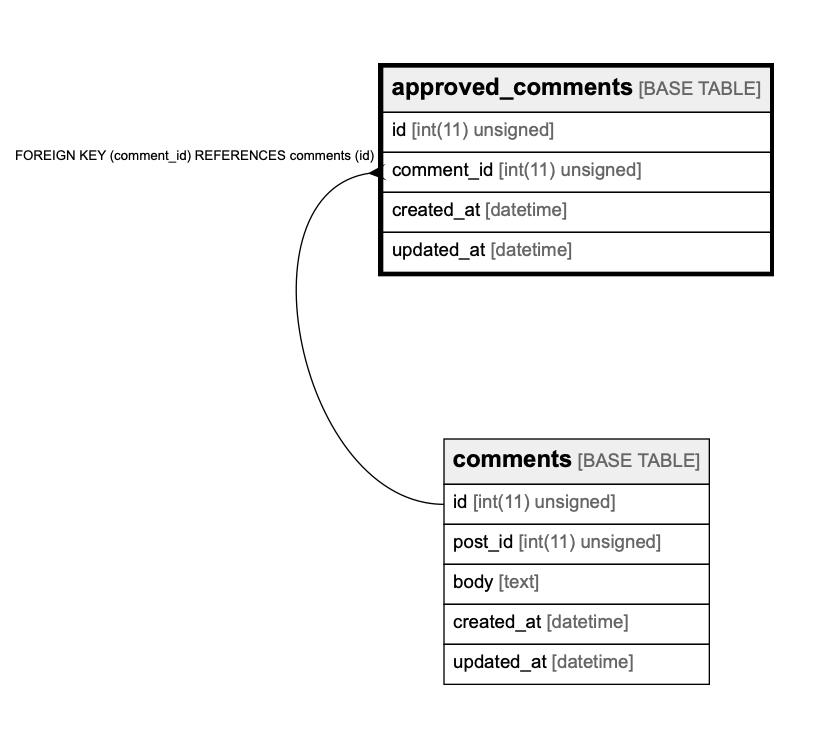

# approved_comments

## Description

<details>
<summary><strong>Table Definition</strong></summary>

```sql
CREATE TABLE `approved_comments` (
  `id` int(11) unsigned NOT NULL AUTO_INCREMENT,
  `comment_id` int(11) unsigned NOT NULL,
  `created_at` datetime DEFAULT CURRENT_TIMESTAMP ON UPDATE CURRENT_TIMESTAMP,
  `updated_at` datetime DEFAULT CURRENT_TIMESTAMP ON UPDATE CURRENT_TIMESTAMP,
  PRIMARY KEY (`id`),
  KEY `comment_id` (`comment_id`),
  CONSTRAINT `approved_comments_ibfk_1` FOREIGN KEY (`comment_id`) REFERENCES `comments` (`id`)
) ENGINE=InnoDB AUTO_INCREMENT=1000001 DEFAULT CHARSET=utf8
```

</details>

## Columns

| Name       | Type             | Default           | Nullable | Children | Parents                 | Comment |
| ---------- | ---------------- | ----------------- | -------- | -------- | ----------------------- | ------- |
| id         | int(11) unsigned |                   | false    |          |                         |         |
| comment_id | int(11) unsigned |                   | false    |          | [comments](comments.md) |         |
| created_at | datetime         | CURRENT_TIMESTAMP | true     |          |                         |         |
| updated_at | datetime         | CURRENT_TIMESTAMP | true     |          |                         |         |

## Constraints

| Name                     | Type        | Definition                                        |
| ------------------------ | ----------- | ------------------------------------------------- |
| approved_comments_ibfk_1 | FOREIGN KEY | FOREIGN KEY (comment_id) REFERENCES comments (id) |
| PRIMARY                  | PRIMARY KEY | PRIMARY KEY (id)                                  |

## Indexes

| Name       | Definition                              |
| ---------- | --------------------------------------- |
| comment_id | KEY comment_id (comment_id) USING BTREE |
| PRIMARY    | PRIMARY KEY (id) USING BTREE            |

## Relations



---

> Generated by [tbls](https://github.com/k1LoW/tbls)
