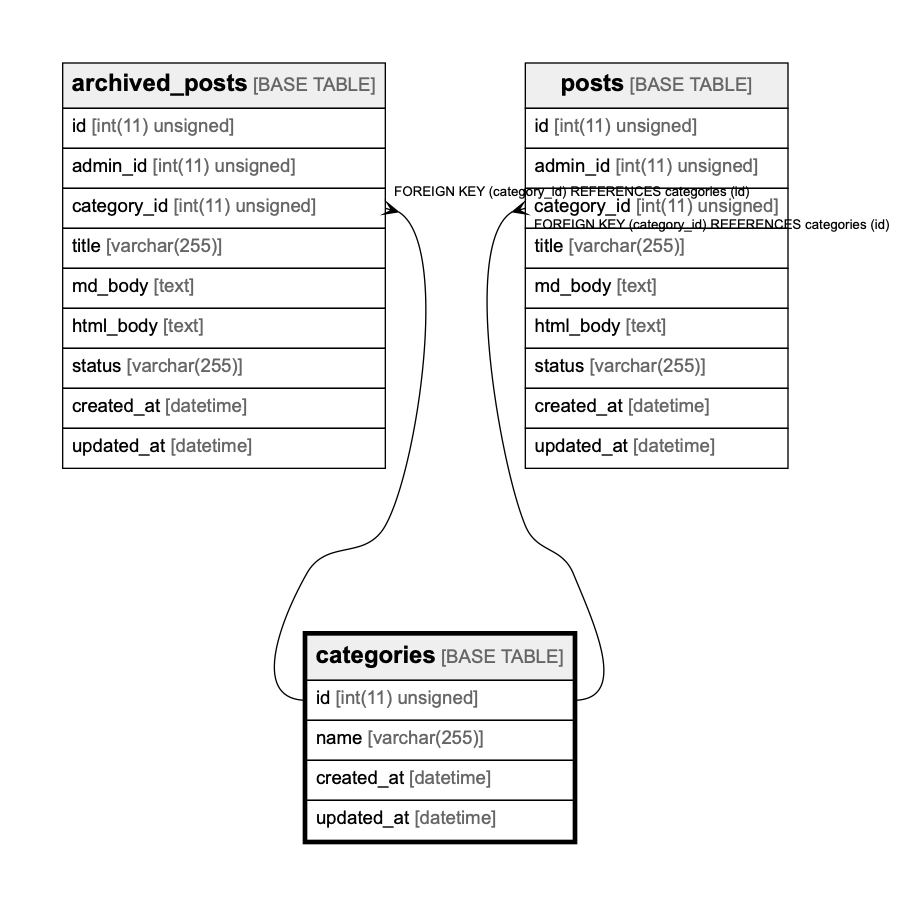

# categories

## Description

<details>
<summary><strong>Table Definition</strong></summary>

```sql
CREATE TABLE `categories` (
  `id` int(11) unsigned NOT NULL AUTO_INCREMENT,
  `name` varchar(255) NOT NULL,
  `created_at` datetime DEFAULT CURRENT_TIMESTAMP ON UPDATE CURRENT_TIMESTAMP,
  `updated_at` datetime DEFAULT CURRENT_TIMESTAMP ON UPDATE CURRENT_TIMESTAMP,
  PRIMARY KEY (`id`),
  UNIQUE KEY `name` (`name`)
) ENGINE=InnoDB AUTO_INCREMENT=1048566 DEFAULT CHARSET=utf8
```

</details>

## Columns

| Name       | Type             | Default           | Nullable | Children                                              | Parents | Comment |
| ---------- | ---------------- | ----------------- | -------- | ----------------------------------------------------- | ------- | ------- |
| id         | int(11) unsigned |                   | false    | [archived_posts](archived_posts.md) [posts](posts.md) |         |         |
| name       | varchar(255)     |                   | false    |                                                       |         |         |
| created_at | datetime         | CURRENT_TIMESTAMP | true     |                                                       |         |         |
| updated_at | datetime         | CURRENT_TIMESTAMP | true     |                                                       |         |         |

## Constraints

| Name    | Type        | Definition             |
| ------- | ----------- | ---------------------- |
| name    | UNIQUE      | UNIQUE KEY name (name) |
| PRIMARY | PRIMARY KEY | PRIMARY KEY (id)       |

## Indexes

| Name    | Definition                         |
| ------- | ---------------------------------- |
| PRIMARY | PRIMARY KEY (id) USING BTREE       |
| name    | UNIQUE KEY name (name) USING BTREE |

## Relations



---

> Generated by [tbls](https://github.com/k1LoW/tbls)
