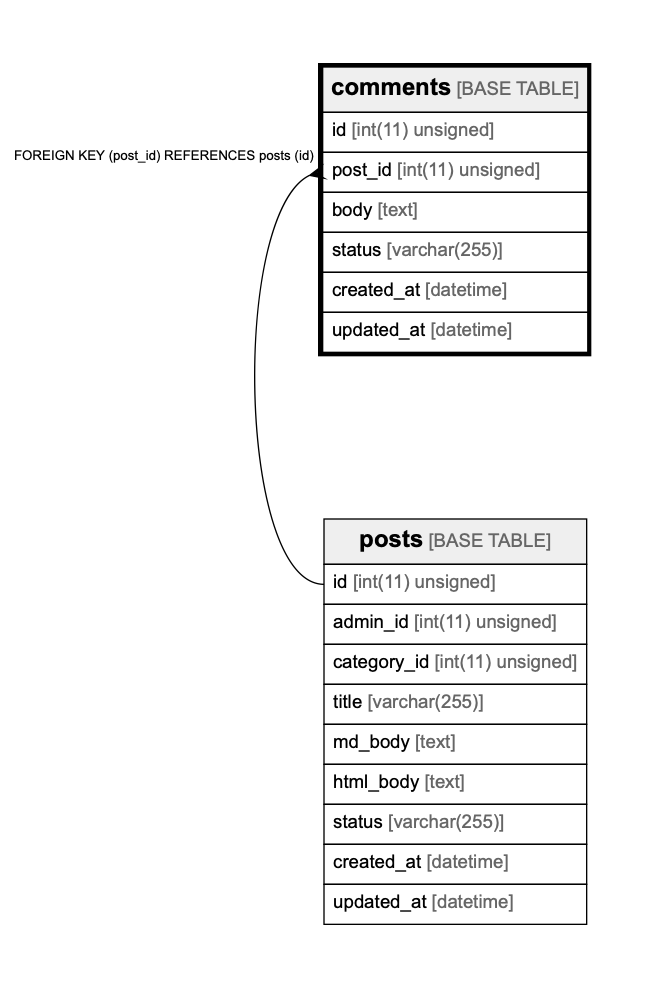

# comments

## Description

<details>
<summary><strong>Table Definition</strong></summary>

```sql
CREATE TABLE `comments` (
  `id` int(11) unsigned NOT NULL AUTO_INCREMENT,
  `post_id` int(11) unsigned NOT NULL,
  `body` text NOT NULL,
  `status` varchar(255) DEFAULT 'pending',
  `created_at` datetime DEFAULT CURRENT_TIMESTAMP ON UPDATE CURRENT_TIMESTAMP,
  `updated_at` datetime DEFAULT CURRENT_TIMESTAMP ON UPDATE CURRENT_TIMESTAMP,
  PRIMARY KEY (`id`),
  KEY `post_id` (`post_id`),
  CONSTRAINT `comments_ibfk_1` FOREIGN KEY (`post_id`) REFERENCES `posts` (`id`)
) ENGINE=InnoDB AUTO_INCREMENT=1000002 DEFAULT CHARSET=utf8
```

</details>

## Columns

| Name       | Type             | Default           | Nullable | Children | Parents           | Comment |
| ---------- | ---------------- | ----------------- | -------- | -------- | ----------------- | ------- |
| id         | int(11) unsigned |                   | false    |          |                   |         |
| post_id    | int(11) unsigned |                   | false    |          | [posts](posts.md) |         |
| body       | text             |                   | false    |          |                   |         |
| status     | varchar(255)     | pending           | true     |          |                   |         |
| created_at | datetime         | CURRENT_TIMESTAMP | true     |          |                   |         |
| updated_at | datetime         | CURRENT_TIMESTAMP | true     |          |                   |         |

## Constraints

| Name            | Type        | Definition                                  |
| --------------- | ----------- | ------------------------------------------- |
| comments_ibfk_1 | FOREIGN KEY | FOREIGN KEY (post_id) REFERENCES posts (id) |
| PRIMARY         | PRIMARY KEY | PRIMARY KEY (id)                            |

## Indexes

| Name    | Definition                        |
| ------- | --------------------------------- |
| post_id | KEY post_id (post_id) USING BTREE |
| PRIMARY | PRIMARY KEY (id) USING BTREE      |

## Relations



---

> Generated by [tbls](https://github.com/k1LoW/tbls)
