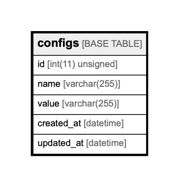

# configs

## Description

<details>
<summary><strong>Table Definition</strong></summary>

```sql
CREATE TABLE `configs` (
  `id` int(11) unsigned NOT NULL AUTO_INCREMENT,
  `name` varchar(255) NOT NULL,
  `value` varchar(255) NOT NULL,
  `created_at` datetime DEFAULT CURRENT_TIMESTAMP ON UPDATE CURRENT_TIMESTAMP,
  `updated_at` datetime DEFAULT CURRENT_TIMESTAMP ON UPDATE CURRENT_TIMESTAMP,
  PRIMARY KEY (`id`)
) ENGINE=InnoDB AUTO_INCREMENT=1000001 DEFAULT CHARSET=utf8
```

</details>

## Columns

| Name       | Type             | Default           | Nullable | Children | Parents | Comment |
| ---------- | ---------------- | ----------------- | -------- | -------- | ------- | ------- |
| id         | int(11) unsigned |                   | false    |          |         |         |
| name       | varchar(255)     |                   | false    |          |         |         |
| value      | varchar(255)     |                   | false    |          |         |         |
| created_at | datetime         | CURRENT_TIMESTAMP | true     |          |         |         |
| updated_at | datetime         | CURRENT_TIMESTAMP | true     |          |         |         |

## Constraints

| Name    | Type        | Definition       |
| ------- | ----------- | ---------------- |
| PRIMARY | PRIMARY KEY | PRIMARY KEY (id) |

## Indexes

| Name    | Definition                   |
| ------- | ---------------------------- |
| PRIMARY | PRIMARY KEY (id) USING BTREE |

## Relations



---

> Generated by [tbls](https://github.com/k1LoW/tbls)
