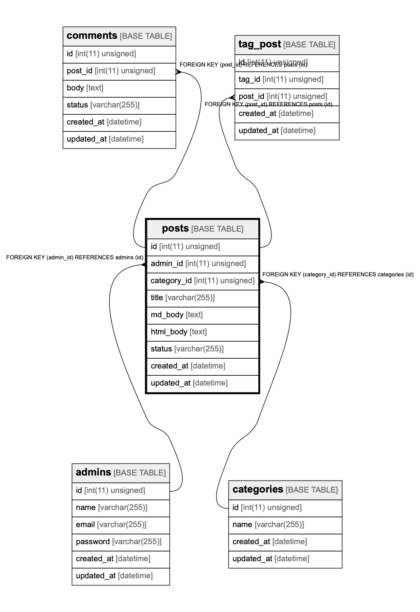

# posts

## Description

<details>
<summary><strong>Table Definition</strong></summary>

```sql
CREATE TABLE `posts` (
  `id` int(11) unsigned NOT NULL AUTO_INCREMENT,
  `admin_id` int(11) unsigned NOT NULL,
  `category_id` int(11) unsigned NOT NULL,
  `title` varchar(255) DEFAULT NULL,
  `md_body` text,
  `html_body` text,
  `status` varchar(255) DEFAULT 'draft',
  `created_at` datetime DEFAULT CURRENT_TIMESTAMP ON UPDATE CURRENT_TIMESTAMP,
  `updated_at` datetime DEFAULT CURRENT_TIMESTAMP ON UPDATE CURRENT_TIMESTAMP,
  PRIMARY KEY (`id`),
  KEY `admin_id` (`admin_id`),
  KEY `category_id` (`category_id`),
  CONSTRAINT `posts_ibfk_1` FOREIGN KEY (`admin_id`) REFERENCES `admins` (`id`),
  CONSTRAINT `posts_ibfk_2` FOREIGN KEY (`category_id`) REFERENCES `categories` (`id`)
) ENGINE=InnoDB AUTO_INCREMENT=1048567 DEFAULT CHARSET=utf8
```

</details>

## Columns

| Name        | Type             | Default           | Nullable | Children                                        | Parents                     | Comment |
| ----------- | ---------------- | ----------------- | -------- | ----------------------------------------------- | --------------------------- | ------- |
| id          | int(11) unsigned |                   | false    | [comments](comments.md) [tag_post](tag_post.md) |                             |         |
| admin_id    | int(11) unsigned |                   | false    |                                                 | [admins](admins.md)         |         |
| category_id | int(11) unsigned |                   | false    |                                                 | [categories](categories.md) |         |
| title       | varchar(255)     |                   | true     |                                                 |                             |         |
| md_body     | text             |                   | true     |                                                 |                             |         |
| html_body   | text             |                   | true     |                                                 |                             |         |
| status      | varchar(255)     | draft             | true     |                                                 |                             |         |
| created_at  | datetime         | CURRENT_TIMESTAMP | true     |                                                 |                             |         |
| updated_at  | datetime         | CURRENT_TIMESTAMP | true     |                                                 |                             |         |

## Constraints

| Name         | Type        | Definition                                           |
| ------------ | ----------- | ---------------------------------------------------- |
| posts_ibfk_1 | FOREIGN KEY | FOREIGN KEY (admin_id) REFERENCES admins (id)        |
| posts_ibfk_2 | FOREIGN KEY | FOREIGN KEY (category_id) REFERENCES categories (id) |
| PRIMARY      | PRIMARY KEY | PRIMARY KEY (id)                                     |

## Indexes

| Name        | Definition                                |
| ----------- | ----------------------------------------- |
| admin_id    | KEY admin_id (admin_id) USING BTREE       |
| category_id | KEY category_id (category_id) USING BTREE |
| PRIMARY     | PRIMARY KEY (id) USING BTREE              |

## Relations



---

> Generated by [tbls](https://github.com/k1LoW/tbls)
