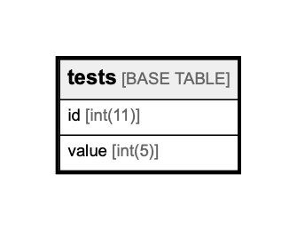

# tests

## Description

<details>
<summary><strong>Table Definition</strong></summary>

```sql
CREATE TABLE `tests` (
  `id` int(11) NOT NULL AUTO_INCREMENT,
  `value` int(5) NOT NULL DEFAULT '0',
  PRIMARY KEY (`id`)
) ENGINE=InnoDB AUTO_INCREMENT=11 DEFAULT CHARSET=utf8mb4 COLLATE=utf8mb4_bin
```

</details>

## Columns

| Name  | Type    | Default | Nullable | Children | Parents | Comment |
| ----- | ------- | ------- | -------- | -------- | ------- | ------- |
| id    | int(11) |         | false    |          |         |         |
| value | int(5)  | 0       | false    |          |         |         |

## Constraints

| Name    | Type        | Definition       |
| ------- | ----------- | ---------------- |
| PRIMARY | PRIMARY KEY | PRIMARY KEY (id) |

## Indexes

| Name    | Definition                   |
| ------- | ---------------------------- |
| PRIMARY | PRIMARY KEY (id) USING BTREE |

## Relations



---

> Generated by [tbls](https://github.com/k1LoW/tbls)
