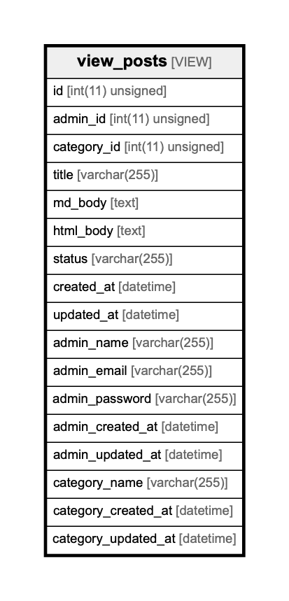

# view_posts

## Description

VIEW

<details>
<summary><strong>Table Definition</strong></summary>

```sql
CREATE VIEW view_posts AS (select `gobel`.`posts`.`id` AS `id`,`gobel`.`posts`.`admin_id` AS `admin_id`,`gobel`.`posts`.`category_id` AS `category_id`,`gobel`.`posts`.`title` AS `title`,`gobel`.`posts`.`md_body` AS `md_body`,`gobel`.`posts`.`html_body` AS `html_body`,`gobel`.`posts`.`status` AS `status`,`gobel`.`posts`.`created_at` AS `created_at`,`gobel`.`posts`.`updated_at` AS `updated_at`,`gobel`.`admins`.`name` AS `admin_name`,`gobel`.`admins`.`email` AS `admin_email`,`gobel`.`admins`.`password` AS `admin_password`,`gobel`.`admins`.`created_at` AS `admin_created_at`,`gobel`.`admins`.`updated_at` AS `admin_updated_at`,`gobel`.`categories`.`name` AS `category_name`,`gobel`.`categories`.`created_at` AS `category_created_at`,`gobel`.`categories`.`updated_at` AS `category_updated_at` from ((`gobel`.`posts` left join `gobel`.`admins` on((`gobel`.`admins`.`id` = `gobel`.`posts`.`admin_id`))) left join `gobel`.`categories` on((`gobel`.`categories`.`id` = `gobel`.`posts`.`category_id`))))
```

</details>

## Columns

| Name                | Type             | Default           | Nullable | Children | Parents | Comment |
| ------------------- | ---------------- | ----------------- | -------- | -------- | ------- | ------- |
| id                  | int(11) unsigned | 0                 | false    |          |         |         |
| admin_id            | int(11) unsigned |                   | false    |          |         |         |
| category_id         | int(11) unsigned |                   | false    |          |         |         |
| title               | varchar(255)     |                   | true     |          |         |         |
| md_body             | text             |                   | true     |          |         |         |
| html_body           | text             |                   | true     |          |         |         |
| status              | varchar(255)     | draft             | true     |          |         |         |
| created_at          | datetime         | CURRENT_TIMESTAMP | true     |          |         |         |
| updated_at          | datetime         | CURRENT_TIMESTAMP | true     |          |         |         |
| admin_name          | varchar(255)     |                   | true     |          |         |         |
| admin_email         | varchar(255)     |                   | true     |          |         |         |
| admin_password      | varchar(255)     |                   | true     |          |         |         |
| admin_created_at    | datetime         | CURRENT_TIMESTAMP | true     |          |         |         |
| admin_updated_at    | datetime         | CURRENT_TIMESTAMP | true     |          |         |         |
| category_name       | varchar(255)     |                   | true     |          |         |         |
| category_created_at | datetime         | CURRENT_TIMESTAMP | true     |          |         |         |
| category_updated_at | datetime         | CURRENT_TIMESTAMP | true     |          |         |         |

## Relations



---

> Generated by [tbls](https://github.com/k1LoW/tbls)
