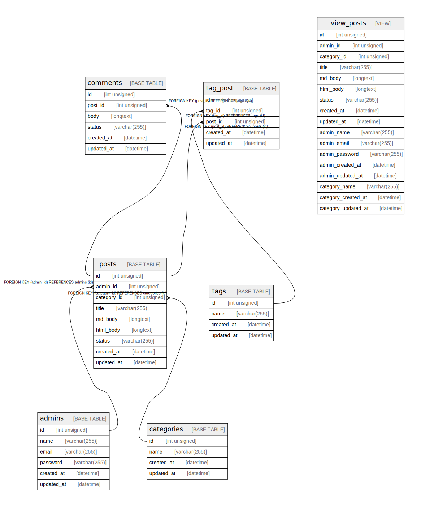

# gobel

## Tables

| Name | Columns | Comment | Type |
| ---- | ------- | ------- | ---- |
| [admins](admins.md) | 6 |  | BASE TABLE |
| [archived_comments](archived_comments.md) | 6 |  | BASE TABLE |
| [archived_posts](archived_posts.md) | 9 |  | BASE TABLE |
| [archived_tag_post](archived_tag_post.md) | 5 |  | BASE TABLE |
| [categories](categories.md) | 4 |  | BASE TABLE |
| [comments](comments.md) | 6 |  | BASE TABLE |
| [posts](posts.md) | 9 |  | BASE TABLE |
| [tag_post](tag_post.md) | 5 |  | BASE TABLE |
| [tags](tags.md) | 4 |  | BASE TABLE |
| [view_posts](view_posts.md) | 17 | VIEW | VIEW |

## Relations

---

> Generated by [tbls](https://github.com/k1LoW/tbls)
