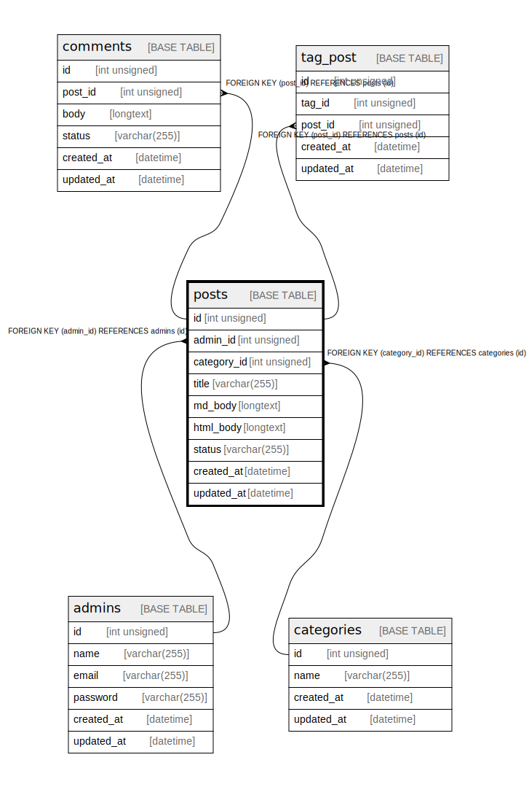

# posts

## Description

<details>
<summary><strong>Table Definition</strong></summary>

```sql
CREATE TABLE `posts` (
  `id` int unsigned NOT NULL AUTO_INCREMENT,
  `admin_id` int unsigned NOT NULL,
  `category_id` int unsigned NOT NULL,
  `title` varchar(255) DEFAULT NULL,
  `md_body` longtext,
  `html_body` longtext,
  `status` varchar(255) DEFAULT 'draft',
  `created_at` datetime DEFAULT CURRENT_TIMESTAMP ON UPDATE CURRENT_TIMESTAMP,
  `updated_at` datetime DEFAULT CURRENT_TIMESTAMP ON UPDATE CURRENT_TIMESTAMP,
  PRIMARY KEY (`id`),
  KEY `admin_id` (`admin_id`),
  KEY `index_posts_status` (`status`),
  KEY `index_posts_category_id` (`category_id`),
  CONSTRAINT `posts_ibfk_1` FOREIGN KEY (`admin_id`) REFERENCES `admins` (`id`),
  CONSTRAINT `posts_ibfk_2` FOREIGN KEY (`category_id`) REFERENCES `categories` (`id`)
) ENGINE=InnoDB AUTO_INCREMENT=[Redacted by tbls] DEFAULT CHARSET=utf8mb3
```

</details>

## Columns

| Name | Type | Default | Nullable | Extra Definition | Children | Parents | Comment |
| ---- | ---- | ------- | -------- | ---------------- | -------- | ------- | ------- |
| id | int unsigned |  | false | auto_increment | [comments](comments.md) [tag_post](tag_post.md) |  |  |
| admin_id | int unsigned |  | false |  |  | [admins](admins.md) |  |
| category_id | int unsigned |  | false |  |  | [categories](categories.md) |  |
| title | varchar(255) |  | true |  |  |  |  |
| md_body | longtext |  | true |  |  |  |  |
| html_body | longtext |  | true |  |  |  |  |
| status | varchar(255) | draft | true |  |  |  |  |
| created_at | datetime | CURRENT_TIMESTAMP | true | DEFAULT_GENERATED on update CURRENT_TIMESTAMP |  |  |  |
| updated_at | datetime | CURRENT_TIMESTAMP | true | DEFAULT_GENERATED on update CURRENT_TIMESTAMP |  |  |  |

## Constraints

| Name | Type | Definition |
| ---- | ---- | ---------- |
| posts_ibfk_1 | FOREIGN KEY | FOREIGN KEY (admin_id) REFERENCES admins (id) |
| posts_ibfk_2 | FOREIGN KEY | FOREIGN KEY (category_id) REFERENCES categories (id) |
| PRIMARY | PRIMARY KEY | PRIMARY KEY (id) |

## Indexes

| Name | Definition |
| ---- | ---------- |
| admin_id | KEY admin_id (admin_id) USING BTREE |
| index_posts_category_id | KEY index_posts_category_id (category_id) USING BTREE |
| index_posts_status | KEY index_posts_status (status) USING BTREE |
| PRIMARY | PRIMARY KEY (id) USING BTREE |

## Relations



---

> Generated by [tbls](https://github.com/k1LoW/tbls)
