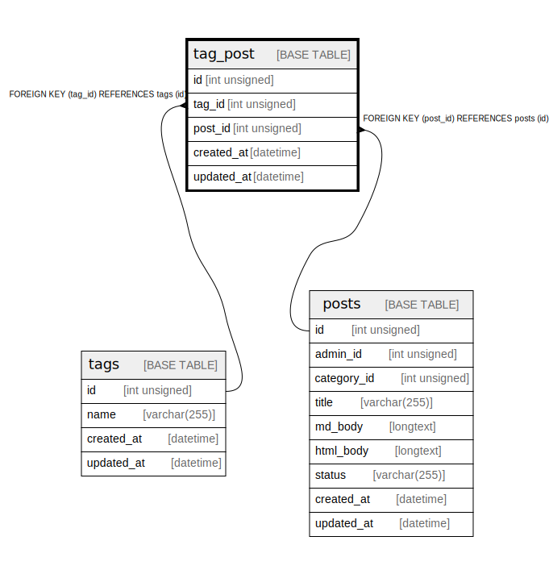

# tag_post

## Description

<details>
<summary><strong>Table Definition</strong></summary>

```sql
CREATE TABLE `tag_post` (
  `id` int unsigned NOT NULL AUTO_INCREMENT,
  `tag_id` int unsigned NOT NULL,
  `post_id` int unsigned NOT NULL,
  `created_at` datetime DEFAULT CURRENT_TIMESTAMP ON UPDATE CURRENT_TIMESTAMP,
  `updated_at` datetime DEFAULT CURRENT_TIMESTAMP ON UPDATE CURRENT_TIMESTAMP,
  PRIMARY KEY (`id`),
  KEY `index_tag_post_tag_id` (`tag_id`),
  KEY `index_tag_post_post_id` (`post_id`),
  CONSTRAINT `tag_post_ibfk_1` FOREIGN KEY (`tag_id`) REFERENCES `tags` (`id`),
  CONSTRAINT `tag_post_ibfk_2` FOREIGN KEY (`post_id`) REFERENCES `posts` (`id`)
) ENGINE=InnoDB AUTO_INCREMENT=[Redacted by tbls] DEFAULT CHARSET=utf8mb3
```

</details>

## Columns

| Name | Type | Default | Nullable | Extra Definition | Children | Parents | Comment |
| ---- | ---- | ------- | -------- | ---------------- | -------- | ------- | ------- |
| id | int unsigned |  | false | auto_increment |  |  |  |
| tag_id | int unsigned |  | false |  |  | [tags](tags.md) |  |
| post_id | int unsigned |  | false |  |  | [posts](posts.md) |  |
| created_at | datetime | CURRENT_TIMESTAMP | true | DEFAULT_GENERATED on update CURRENT_TIMESTAMP |  |  |  |
| updated_at | datetime | CURRENT_TIMESTAMP | true | DEFAULT_GENERATED on update CURRENT_TIMESTAMP |  |  |  |

## Constraints

| Name | Type | Definition |
| ---- | ---- | ---------- |
| PRIMARY | PRIMARY KEY | PRIMARY KEY (id) |
| tag_post_ibfk_1 | FOREIGN KEY | FOREIGN KEY (tag_id) REFERENCES tags (id) |
| tag_post_ibfk_2 | FOREIGN KEY | FOREIGN KEY (post_id) REFERENCES posts (id) |

## Indexes

| Name | Definition |
| ---- | ---------- |
| index_tag_post_post_id | KEY index_tag_post_post_id (post_id) USING BTREE |
| index_tag_post_tag_id | KEY index_tag_post_tag_id (tag_id) USING BTREE |
| PRIMARY | PRIMARY KEY (id) USING BTREE |

## Relations



---

> Generated by [tbls](https://github.com/k1LoW/tbls)
